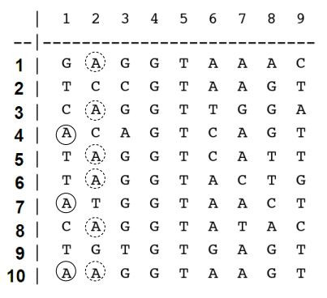
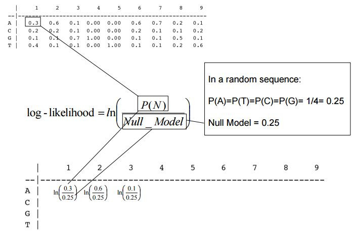

Task 1:
A very early step in splice site recognition is exon definition, a process that is as yet poorly understood. Communication between the two ends of an exon is thought to be required for this step. Computational discovery of the exon-intron border or the intron-exon border or the transcription factor binding sites (TFBS) is a challenging but important problem of bioinformatics. Implement a software application for DNA motif finding by following the steps below.

A total of 9 known motif sequences are given:

These sequences represent the exon-intron boundary.

1. make the count matrix
2. make the weight matrix
3. make the relative frequencies matrix
4. make the Log-likelihoods Matrix

5. Analize sequence S by using the Log-likelihoods Matrix:

S="CAGGTTGGAAACGTAATCAGCGATTACGCATGACGTAA"

Calculate the score for each sliding window.

Do you have signals indicating that the S sequence contains an exon-intron border?

Task 1 output:
COUNT MATRIX
A [3, 6, 1, 0, 0, 6, 7, 2, 1]
C [2, 2, 1, 0, 0, 2, 1, 1, 2]
G [1, 1, 7, 10, 0, 1, 1, 5, 1]
T [4, 1, 1, 0, 10, 1, 1, 2, 6]

RELATIVE FREQUENCY MATRIX
A [0.3, 0.6, 0.1, 0.0, 0.0, 0.6, 0.7, 0.2, 0.1]
C [0.2, 0.2, 0.1, 0.0, 0.0, 0.2, 0.1, 0.1, 0.2]
G [0.1, 0.1, 0.7, 1.0, 0.0, 0.1, 0.1, 0.5, 0.1]
T [0.4, 0.1, 0.1, 0.0, 1.0, 0.1, 0.1, 0.2, 0.6]

LOG-LIKELIHOOD MATRIX
A [0.1823215567939546, 0.8754687373538999, -0.916290731874155, -inf, -inf, 0.8754687373538999, 1.0296194171811581, -0.2231435513142097, -0.916290731874155]
C [-0.2231435513142097, -0.2231435513142097, -0.916290731874155, -inf, -inf, -0.2231435513142097, -0.916290731874155, -0.916290731874155, -0.2231435513142097]
G [-0.916290731874155, -0.916290731874155, 1.0296194171811581, 1.3862943611198906, -inf, -0.916290731874155, -0.916290731874155, 0.6931471805599453, -0.916290731874155]
T [0.47000362924573563, -0.916290731874155, -0.916290731874155, -inf, 1.3862943611198906, -0.916290731874155, -0.916290731874155, -0.2231435513142097, 0.8754687373538999]

SLIDING WINDOW SCORES
Pos  0  CAGGTTGGA  Score = 2.399
Pos  1  AGGTTGGAA  Score = -inf
Pos  2  GGTTGGAAA  Score = -inf
Pos  3  GTTGGAAAC  Score = -inf
Pos  4  TTGGAAACG  Score = -inf
Pos  5  TGGAAACGT  Score = -inf
Pos  6  GGAAACGTA  Score = -inf
Pos  7  GAAACGTAA  Score = -inf
Pos  8  AAACGTAAT  Score = -inf
Pos  9  AACGTAATC  Score = 4.373
Pos 10  ACGTAATCA  Score = -inf
Pos 11  CGTAATCAG  Score = -inf
Pos 12  GTAATCAGC  Score = -inf
Pos 13  TAATCAGCG  Score = -inf
Pos 14  AATCAGCGA  Score = -inf
Pos 15  ATCAGCGAT  Score = -inf
Pos 16  TCAGCGATT  Score = -inf
Pos 17  CAGCGATTA  Score = -inf
Pos 18  AGCGATTAC  Score = -inf
Pos 18  AGCGATTAC  Score = -inf
Pos 19  GCGATTACG  Score = -inf
Pos 20  CGATTACGC  Score = -inf
Pos 21  GATTACGCA  Score = -inf
Pos 22  ATTACGCAT  Score = -inf
Pos 18  AGCGATTAC  Score = -inf
Pos 19  GCGATTACG  Score = -inf
Pos 20  CGATTACGC  Score = -inf
Pos 18  AGCGATTAC  Score = -inf
Pos 18  AGCGATTAC  Score = -inf
Pos 18  AGCGATTAC  Score = -inf
Pos 19  GCGATTACG  Score = -inf
Pos 20  CGATTACGC  Score = -inf
Pos 21  GATTACGCA  Score = -inf
Pos 22  ATTACGCAT  Score = -inf
Pos 23  TTACGCATG  Score = -inf
Pos 24  TACGCATGA  Score = -inf
Pos 25  ACGCATGAC  Score = -inf
Pos 26  CGCATGACG  Score = -inf
Pos 27  GCATGACGT  Score = -inf
Pos 28  CATGACGTA  Score = -inf
Pos 29  ATGACGTAA  Score = -inf

BEST MATCH
Position: 9
Sequence: AACGTAATC
Score: 4.372889336420119

Conclusion: Exon–intron border signal detected.

Most sliding windows obtain a score of −∞ because the log-likelihood model is built directly from observed frequencies without pseudocounts. Any nucleotide that never appeared at a given position in the training motifs has probability zero, causing the log-likelihood to be −∞. This behavior is expected and highlights highly conserved positions in the exon–intron boundary motif.

Task 2:
Download 10 influenza genomes. Adapt your application from the previous assignment in order to scan each genome for possible motifs.
For each genome make a chart that shows the signal with the most likely locations of real functional motifs.